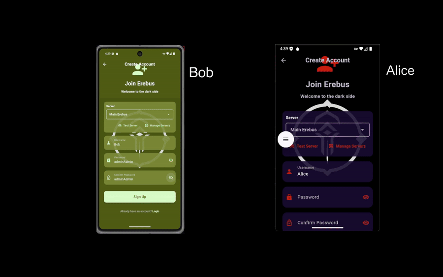

# ⚡ Erebus

<p align="center">
  
</p>
> **Next-Generation Post-Quantum End-to-End Encrypted Messaging Platform** > Built with Flutter and PocketBase, powered by cutting-edge quantum-resistant cryptographic primitives (ML-KEM and Dilithium).

---

## 📱 App Demo



---

## 📌 Overview

**Erebus** is a secure-by-design messaging client that brings state-of-the-art **Post-Quantum End-to-End Encryption (PQ-E2EE)** to mobile communications. Backed by **PocketBase**, the platform guarantees that messages, metadata, and attachments remain entirely confidential. 

Every communication is independently encrypted per-recipient using **ML-KEM-512** for secure key encapsulation, authenticated via **Dilithium2 digital signatures**, and protected using **XChaCha20-Poly1305** symmetric authenticated encryption. The server acts as a blind broker, never possessing the means to view plaintext content or compromise private keys.

---

## 🚀 Key Features

* **Post-Quantum E2EE:** Secure against both classical attacks and future quantum computing threats using **ML-KEM-512** and **Dilithium2**.
* **Zero-Trust Infrastructure:** Private keys are generated and stored exclusively on the user's device via hardware-backed secure storage.
* **Realtime Messaging:** Instant message delivery, typing updates, and sync loops powered by PocketBase live subscriptions.
* **Rich Interactions:** Full support for multi-recipient group chats, encrypted file attachments (up to 200 MB), replies, editing, soft deletions, and deep text search.
* **Multi-Server Core:** Dynamically switch, add, or modify PocketBase backend instances from the login screen, including native support for `.onion` Tor routing addresses.
* **Deep Visual Customization:** Over 50 distinct color themes selectable natively and persisted across sessions.

---

## 🛠️ Technology Stack

| Layer | Technology Used | Description |
| :--- | :--- | :--- |
| **Frontend Framework** | Flutter (Dart SDK `^3.10.1`) | High-performance cross-platform UI engine |
| **State Management** | Provider | Reactive application architecture and state propagation |
| **Backend & Sync** | PocketBase | Lightweight backend for authentication, database records, and realtime events |
| **Local Secure Storage** | `flutter_secure_storage` | Device-isolated containment for sessions and cryptographic keys |
| **PQ Encryption** | ML-KEM-512 & Dilithium2 | Post-Quantum cryptographic primitives via `oqs` |
| **Symmetric Cipher** | XChaCha20-Poly1305 | High-speed authenticated encryption with extended nonces |

---

## 📖 Extended Documentation

For deeper insight into specific layers of the architecture, consult the comprehensive documentation guides available in the `docs/` repository directory:

* 📑 **[Getting Started](docs/getting-started.md)** – Environment prerequisites, installation guidelines, dependency maps, first-run routines, and connectivity troubleshooting.
* 🏗️ **[Architecture](docs/architecture.md)** – System engineering diagrams, zero-trust cryptographic models, and granular cross-network payload data flows.
* 📁 **[Project Structure](docs/project-structure.md)** – High-level directory maps, module encapsulation guidelines, and individual development responsibilities.
* 🔑 **[E2EE Cryptography](docs/e2ee-cryptography.md)** – Detailed protocol walkthroughs detailing ML-KEM encapsulation, HKDF-SHA256 session key derivation, and Dilithium signature processing.
* 🗄️ **[PocketBase Schema](docs/pocketbase-schema.md)** – Backend layout references, structural rules, and collection expectations for the `users`, `chats`, and `messages` databases.
* 🖥️ **[Screens & Features](docs/screens-and-features.md)** – User interface layout specifications, internal navigation trees, component behaviors, and messaging feature catalogs.
* 💾 **[State & Storage](docs/state-and-storage.md)** – Local persistence architecture, reactive multi-provider state orchestration, and isolated multi-server containment data structures.
* 🎨 **[Themes](docs/themes.md)** – Deep layout reference covering all 50 available visual styling palettes and developer steps to configure brand new color layouts.
* 🚀 **[Build & Deploy](docs/build-and-deploy.md)** – Android compilation protocols, production build variant flags, signing keys setup, and release deployment pipelines.
* 📦 **[Dependencies](docs/dependencies.md)** – Granular tracking log of all included software packages, version constraints, and their distinct roles in the architecture.

---
## ⚡ Quick Start

### Prerequisites

* **Flutter SDK** (Dart SDK constraint: `^3.10.1`)
* A running **PocketBase Server** reachable from your target environment.

  > ⚠️ **Note:** The backend default configuration targets a `.onion` address. If your server is hosted inside the Tor network, ensure your host device running the application is properly connected via a Tor proxy or client before authentication.

### Compilation

1. **Clone the repository:**

   ```bash
   git clone https://github.com/Erebus9456/erebus-frontend.git
   cd erebus-frontend
   ```

2. **Fetch dependencies:**

   ```bash
   flutter pub get
   ```

3. **Launch the application:**

   ```bash
   flutter run
   ```

### First-Run Sequence

1. Upon initial launch, configure your server host routing using the Server Selector on the authentication view.
2. Complete your Registration or Login profile.
3. On successful authentication, the local device automatically configures your unique PQ-E2EE asymmetric keypairs and syncs the public keys to the remote host instance.

## 📦 Build & Release

### Android APK

```bash
flutter build apk --release
```

**Output Path:** `build/app/outputs/flutter-apk/app-release.apk`

### Android App Bundle (AAB)

```bash
flutter build appbundle --release
```

**Output Path:** `build/app/outputs/bundle/release/app-release.aab`

## 📝 Developer Notes & Assumptions

* **Target Scope:** This repository is dedicated exclusively to the Flutter client application. This iteration officially targets Android; alternative native system architecture layers are excluded.
* **Database Synchronization:** The application explicitly expects an operational PocketBase layout mapping to structural `users`, `chats`, and `messages` collection endpoints as defined in the PocketBase Schema Docs.

🔗 **Backend Core Source:** [Erebus Backend Repository](https://github.com/Erebus9456/erebus-backend)
