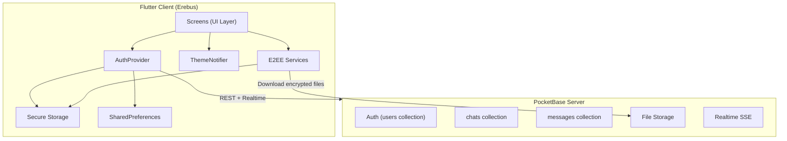
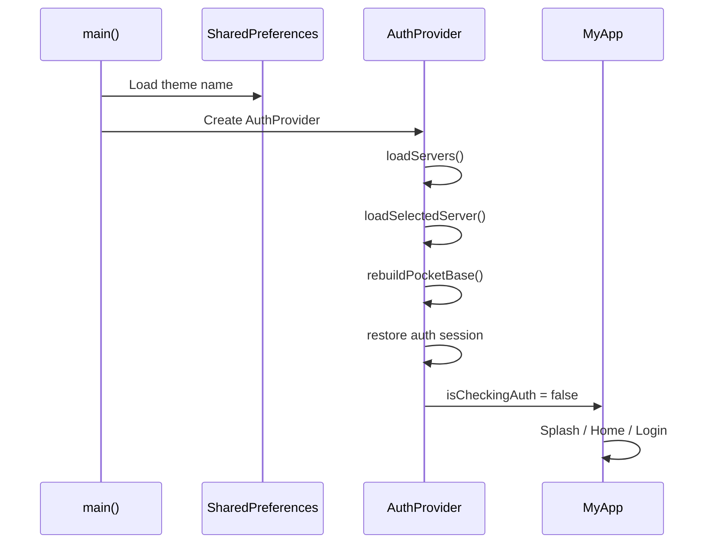
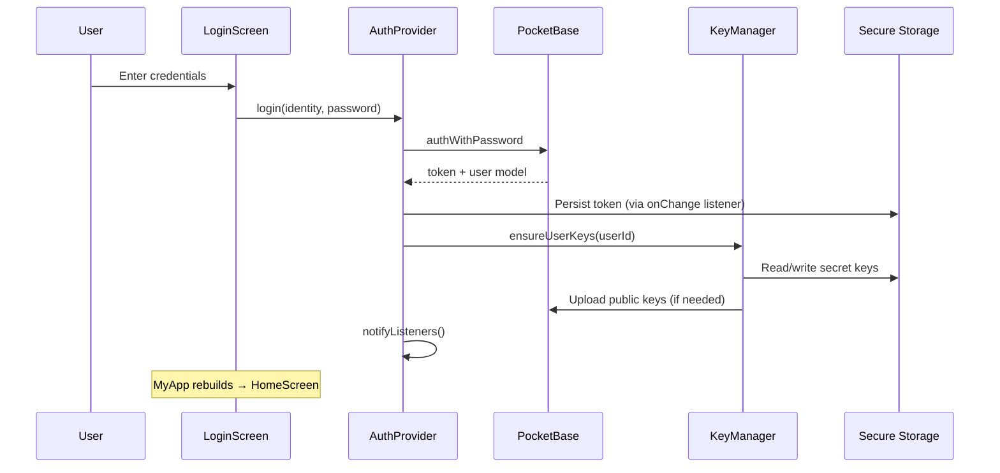
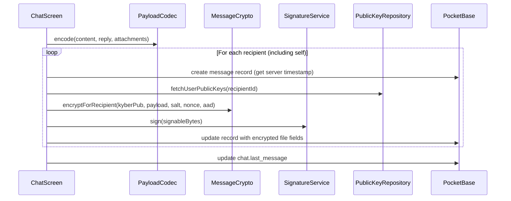
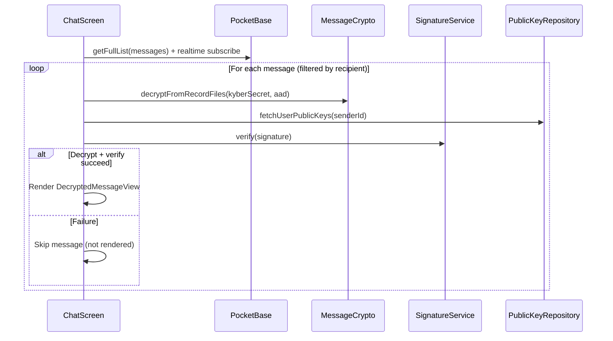

# Architecture

## System Overview

Erebus follows a **client-server** architecture where the Flutter app handles all encryption/decryption locally and PocketBase serves as the untrusted transport and storage layer.



## Layered Design

### 1. Presentation Layer (`lib/screens/`)

Flutter widgets for each screen. Screens consume state via `Provider` and call PocketBase/E2EE services directly or through `AuthProvider`.

| Screen | Role |
|--------|------|
| `SplashPage` | Loading state during auth restore |
| `LoginScreen` / `RegisterScreen` | Authentication entry points |
| `HomeScreen` | Chat list, search, navigation drawer |
| `ChatScreen` | Messaging, encryption, attachments |
| `ProfileScreen` | User profile editing |
| `ThemeSelector` | Theme preview and selection |

### 2. State Layer (`lib/classes/`)

| Class | Pattern | Responsibility |
|-------|---------|----------------|
| `AuthProvider` | `ChangeNotifier` | PocketBase client, server selection, auth lifecycle |
| `ThemeNotifier` | `ChangeNotifier` | Current theme, persistence to SharedPreferences |
| `ServerStore` | Service | Server list CRUD in SharedPreferences |
| `CustomSecureAuthStore` | `AuthStore` | PocketBase token/model persistence per server namespace |
| `AppThemeData` | Data class | Theme color definitions and `ThemeData` conversion |

### 3. Cryptography Layer (`lib/services/e2ee/`)

Self-contained E2EE module with no UI dependencies:

```
key_manager.dart          → Key generation and upload
message_crypto.dart       → KEM + HKDF + AEAD encrypt/decrypt
signature_service.dart    → Dilithium sign/verify
payload_codec.dart        → JSON plaintext payload encoding
public_key_repository.dart→ Fetch and cache user public keys
pb_file_downloader.dart   → Authenticated file download from PocketBase
secure_storage.dart       → Secret key storage key naming
models.dart               → Shared data types
```

### 4. Backend Integration

All server communication goes through the `PocketBase` client instance owned by `AuthProvider`:

- **REST API** — CRUD on collections, file uploads
- **Realtime** — SSE subscriptions on `chats` and `messages` collections
- **Auth** — `authWithPassword`, `authRefresh`, token in `AuthStore`

## Application Bootstrap



Entry point: `lib/main.dart`

1. `WidgetsFlutterBinding.ensureInitialized()`
2. Load theme from `SharedPreferences` (default: `Royal Cipher Dark`)
3. Register `ThemeNotifier` and `AuthProvider` via `MultiProvider`
4. `MyApp` routes based on `authProvider.isCheckingAuth` and `authProvider.isAuthenticated`

## Authentication Flow



### Multi-Server Auth Isolation

Each server URL gets a unique namespace (base64url-encoded URL). Auth tokens and E2EE secret keys are stored with namespace-prefixed keys, so switching servers does not leak sessions across instances.

## Messaging Flow (Send)



Key design decisions:

- **Per-recipient encryption** — One `messages` record per recipient, each encrypted to that recipient's Kyber public key
- **Server timestamp for AAD** — Record is created first; `created` timestamp becomes part of the AEAD associated data
- **Client message group ID** — Random 32-char hex stored in `content` field links all recipient copies for edit/delete

## Messaging Flow (Receive)



## Realtime Subscriptions

| Collection | Subscriber | Trigger |
|------------|------------|---------|
| `chats` | `HomeScreen` | Refetch chat list when user is a member of created/updated chat, or any delete |
| `messages` | `ChatScreen` | Fetch and decrypt new/updated messages for current chat |

## Security Model

| Asset | Storage | Exposure |
|-------|---------|----------|
| Kyber secret key | `flutter_secure_storage` (per server namespace) | Device only |
| Dilithium secret key | `flutter_secure_storage` (per server namespace) | Device only |
| Kyber public key | PocketBase `users` file field | Server (public) |
| Dilithium public key | PocketBase `users` file field | Server (public) |
| Auth token | `flutter_secure_storage` (per server namespace) | Device only |
| Message plaintext | Never stored on server | Ephemeral in client memory |
| Encrypted artifacts | PocketBase `messages` file fields | Server (encrypted) |
| Server list / theme | `shared_preferences` | Device (non-sensitive) |

## Error Handling Philosophy

- **Connection errors** — User-facing messages suggest checking Tor connectivity
- **Decryption failures** — Messages are silently skipped (not rendered) to avoid showing corrupt data
- **Signature verification failures** — Message marked `isVerified: false` but may still render if decryption succeeded
- **Auth refresh failure** — Session cleared from secure storage; user redirected to login

## Related Documentation

- [E2EE Cryptography](./e2ee-cryptography.md) — Algorithm details
- [State & Storage](./state-and-storage.md) — Persistence mechanics
- [PocketBase Schema](./pocketbase-schema.md) — Backend contract
