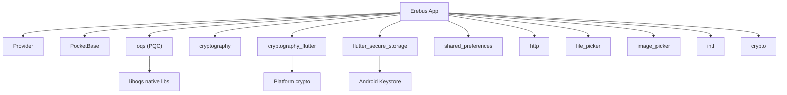

# Dependencies

All dependencies are declared in `pubspec.yaml`. This document explains what each package does in the Erebus project.

## Runtime Dependencies

### Flutter SDK

```yaml
flutter:
  sdk: flutter
```

Core UI framework. SDK constraint: `^3.10.1`.

### UI & Icons

| Package | Version | Purpose |
|---------|---------|---------|
| `cupertino_icons` | ^1.0.8 | iOS-style icons (available but minimally used) |

### State Management

| Package | Version | Purpose |
|---------|---------|---------|
| `provider` | ^6.1.5+1 | `ChangeNotifier` providers for `AuthProvider` and `ThemeNotifier` |

Used in `main.dart` via `MultiProvider` and consumed across all screens with `context.watch` / `context.read`.

### Backend

| Package | Version | Purpose |
|---------|---------|---------|
| `pocketbase` | ^0.23.0+1 | PocketBase Dart SDK — auth, CRUD, realtime, file uploads |

Primary server integration. The `PocketBase` client is owned by `AuthProvider` and used throughout the app.

### Post-Quantum Cryptography

| Package | Version | Purpose |
|---------|---------|---------|
| `oqs` | ^2.2.0 | liboqs bindings — ML-KEM-512 (Kyber) and Dilithium2 |

Used in:
- `key_manager.dart` — Keypair generation
- `message_crypto.dart` — KEM encapsulate/decapsulate
- `signature_service.dart` — Sign and verify

Requires native platform support (NDK on Android).

### Symmetric Cryptography

| Package | Version | Purpose |
|---------|---------|---------|
| `cryptography` | ^2.9.0 | XChaCha20-Poly1305 AEAD, HKDF-SHA256, HMAC |
| `cryptography_flutter` | ^2.3.4 | Platform-native crypto implementations for Flutter |

Used in `message_crypto.dart` for session key derivation and payload encryption/decryption.

### Hashing

| Package | Version | Purpose |
|---------|---------|---------|
| `crypto` | ^3.0.3 | SHA hashing utilities |

Used in `chat_screen.dart` for attachment-related hashing.

### Storage

| Package | Version | Purpose |
|---------|---------|---------|
| `flutter_secure_storage` | ^9.2.4 | Encrypted key-value storage (Android Keystore) |
| `shared_preferences` | ^2.5.3 | Simple key-value preferences |

| Storage | Package | Used For |
|---------|---------|----------|
| Auth tokens, E2EE secrets | `flutter_secure_storage` | `CustomSecureAuthStore`, `E2eeSecureStorage` |
| Theme name, server list | `shared_preferences` | `ThemeNotifier`, `ServerStore` |

### File & Media

| Package | Version | Purpose |
|---------|---------|---------|
| `image_picker` | ^1.2.1 | Gallery image selection for profile avatar |
| `file_picker` | ^8.0.0 | File selection for chat attachments |

### Networking

| Package | Version | Purpose |
|---------|---------|---------|
| `http` | ^1.6.0 | HTTP client for file downloads and multipart uploads |

Used in:
- `pb_file_downloader.dart` — Download PocketBase file fields
- `key_manager.dart` — Upload public key files
- `chat_screen.dart` — Upload encrypted message artifacts
- `profile_screen.dart` — Upload avatar
- `server_selector_card.dart` — Health check requests

### Utilities

| Package | Version | Purpose |
|---------|---------|---------|
| `intl` | ^0.20.2 | Internationalization and date formatting |

Available for date/time formatting (some screens use manual formatting).

## Dev Dependencies

| Package | Version | Purpose |
|---------|---------|---------|
| `flutter_test` | SDK | Flutter testing framework |
| `flutter_lints` | ^6.0.0 | Recommended Dart lint rules |
| `easy_splash_screen` | ^1.0.4 | Splash screen widget with logo and loader |

> Note: `easy_splash_screen` is listed under `dev_dependencies` but imported in `splash_screen.dart` (production code). Consider moving to `dependencies` if build issues arise.

## Dependency Graph



## Version Management

Check for outdated packages:

```bash
flutter pub outdated
```

Upgrade dependencies:

```bash
flutter pub upgrade
```

Major version upgrade:

```bash
flutter pub upgrade --major-versions
```

Lock file (`pubspec.lock`) pins exact resolved versions for reproducible builds.

## Critical Dependencies

These packages are essential for core functionality and cannot be removed without major refactoring:

| Package | Critical Because |
|---------|-----------------|
| `oqs` | All E2EE operations depend on ML-KEM-512 and Dilithium2 |
| `cryptography` | AEAD encryption and HKDF key derivation |
| `pocketbase` | All server communication |
| `flutter_secure_storage` | Secret key and auth token safety |
| `provider` | Entire state management architecture |

## Platform-Specific Notes

### `oqs`

- Wraps liboqs C library via FFI
- Algorithms must be available on the target platform
- Throws `Exception('OQS algorithms unavailable on this platform')` if unsupported
- Objects must be `dispose()`d after use

### `flutter_secure_storage`

- Android: Uses EncryptedSharedPreferences or Keystore (depending on version)
- Keys are namespaced per server URL for isolation

### `cryptography_flutter`

- Enables hardware-accelerated crypto on supported platforms
- Falls back to pure Dart implementation if native unavailable

## Related Documentation

- [E2EE Cryptography](./e2ee-cryptography.md) — How crypto packages are used
- [State & Storage](./state-and-storage.md) — Storage package usage
- [Build & Deploy](./build-and-deploy.md) — Native build requirements
