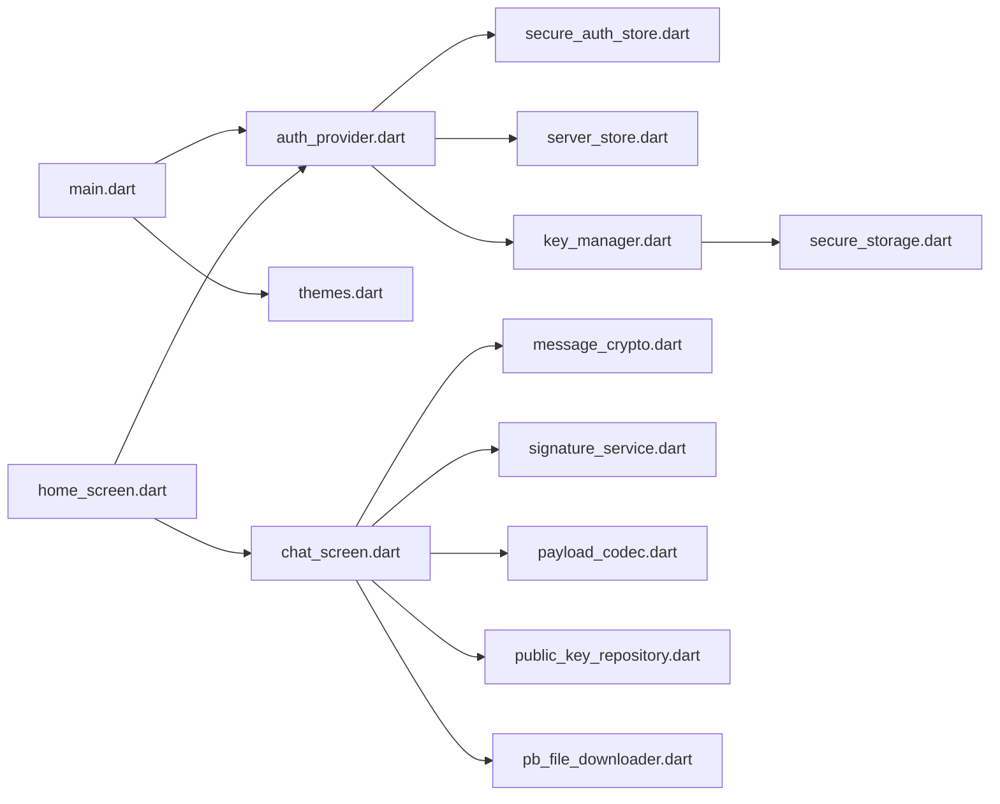

# Project Structure

## Repository Layout

```
erebusv3/
├── android/                    # Android platform project (primary target)
├── assets/                     # Static assets (logos, splash animation)
├── docs/                       # Project documentation (this folder)
├── lib/                        # Application source code
│   ├── main.dart               # App entry point
│   ├── classes/                # State management and shared classes
│   ├── screens/                # UI screens and widgets
│   └── services/               # Backend-agnostic services (E2EE)
├── pubspec.yaml                # Dependencies and Flutter config
├── pubspec.lock                # Locked dependency versions
├── analysis_options.yaml       # Dart linter configuration
└── README.md                   # Project overview
```

> **Note:** iOS, web, Linux, macOS, Windows, and test directories are excluded via `.gitignore`. This project targets Android only.

## `lib/` Directory

### `lib/main.dart`

Application bootstrap:
- Initializes `SharedPreferences` and loads saved theme
- Creates `MultiProvider` with `ThemeNotifier` and `AuthProvider`
- Routes to `SplashPage`, `HomeScreen`, or `LoginScreen` based on auth state

### `lib/classes/`

| File | Description |
|------|-------------|
| `auth_provider.dart` | Central auth and PocketBase client management |
| `secure_auth_store.dart` | PocketBase `AuthStore` backed by `flutter_secure_storage` |
| `server_store.dart` | Server list persistence, URL normalization, namespace derivation |
| `themes.dart` | 50 theme definitions, `ThemeNotifier`, `AppThemeData` |

### `lib/screens/`

```
screens/
├── splash_screen.dart              # SplashPage (session restore loading)
├── profile_screen.dart             # Edit name, bio, status, avatar
├── theme_preview_screen.dart       # ThemeSelector grid
├── auth/
│   ├── login_screen.dart           # Login form + server selector
│   ├── register_screen.dart        # Registration form
│   └── server_selector_card.dart   # Server dropdown, test, manage dialogs
└── ui/
    ├── home_screen.dart            # Chat list, drawer, user search
    ├── chat_screen.dart            # Full messaging UI + E2EE orchestration
    └── group_creation_dialog.dart  # Group chat creation modal
```

### `lib/services/e2ee/`

| File | Description |
|------|-------------|
| `key_manager.dart` | Generate ML-KEM-512 + Dilithium2 keypairs; upload public keys |
| `message_crypto.dart` | Encrypt/decrypt message payloads (KEM → HKDF → XChaCha20-Poly1305) |
| `signature_service.dart` | Build signable byte layout; Dilithium sign/verify |
| `payload_codec.dart` | JSON encode/decode for plaintext message payloads |
| `public_key_repository.dart` | Fetch and in-memory cache user public keys from PocketBase |
| `pb_file_downloader.dart` | Download PocketBase file fields with auth + caching |
| `secure_storage.dart` | Key naming conventions for E2EE secrets in secure storage |
| `models.dart` | `UserPublicKeys`, `DecryptedPayload`, `DecryptedMessageView`, `EncryptedForRecipient` |

## `android/` Directory

Standard Flutter Android project with notable configuration:

| File | Notable Setting |
|------|-----------------|
| `app/src/main/AndroidManifest.xml` | `usesCleartextTraffic="true"` for HTTP servers |
| `app/src/main/kotlin/.../MainActivity.kt` | Standard Flutter activity |
| `app/build.gradle.kts` | App-level Gradle config |
| `build.gradle.kts` | Project-level Gradle config |

## `assets/`

Referenced in `pubspec.yaml`:

```yaml
flutter:
  assets:
    - assets/
```

Expected assets (per code references):
- `assets/app_logo.svg`
- `assets/app_logo_transparent_darkmode.png` (theme logos)
- `assets/splash_lottie_logo_aninmation.json`

## Key File Relationships



## Code Conventions

- **State management:** `provider` with `ChangeNotifier`; screens use `context.watch` / `context.read`
- **PocketBase access:** Field reads use `record.getStringValue()`, `record.get<List<RecordModel>>()`, etc.
- **Error types:** `ClientException` from PocketBase for API errors
- **Imports:** Package imports (`package:erebusv3/...`) throughout
- **Debug output:** `print` / `debugPrint` used in several screens (lint suppressed where needed)

## Adding New Features

| Feature Type | Where to Add |
|--------------|--------------|
| New screen | `lib/screens/` + route from existing screen or `main.dart` |
| New PocketBase interaction | Extend `AuthProvider` or call `authProvider.pb` from screen |
| New crypto primitive | `lib/services/e2ee/` — keep UI-independent |
| New theme | Add entry to `_themeConstants` in `themes.dart` |
| New persisted preference | `shared_preferences` (non-sensitive) or `flutter_secure_storage` (secrets) |

## Related Documentation

- [Screens & Features](./screens-and-features.md) — Detailed screen behavior
- [State & Storage](./state-and-storage.md) — Persistence layer details
- [Dependencies](./dependencies.md) — Package reference
