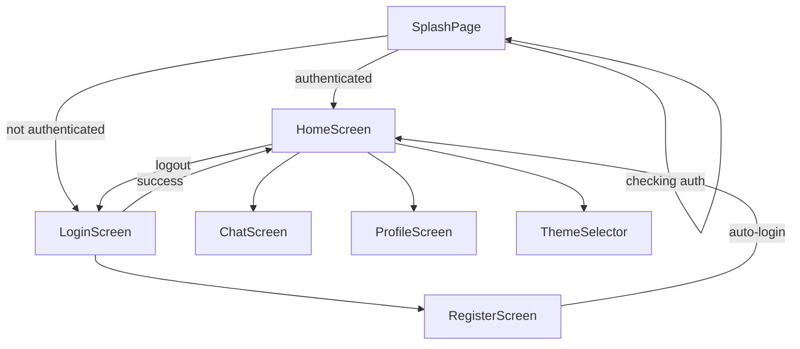

# Screens & Features

## Navigation Map



## SplashPage

**File:** `lib/screens/splash_screen.dart`

| Aspect | Detail |
|--------|--------|
| Shown when | `authProvider.isCheckingAuth == true` |
| Duration | 3 seconds (via `easy_splash_screen`) |
| Content | Theme logo, "Erebus" title, loading spinner |
| Styling | Uses current `AppThemeData` colors and image |

## LoginScreen

**File:** `lib/screens/auth/login_screen.dart`

### Features

- Username/email and password fields with visibility toggle
- **Server Selector Card** — dropdown, test, and manage servers
- Link to registration screen
- Loading state during authentication
- Error handling for `ClientException` and network errors

### Flow

1. User enters credentials
2. `authProvider.login(identity, password)` called
3. On success: `ensureE2eeKeysReady()` → `notifyListeners()` → `MyApp` navigates to Home
4. Welcome snackbar with username

## RegisterScreen

**File:** `lib/screens/auth/register_screen.dart`

### Features

- Username, password, and confirm password fields
- Password minimum length validation (8 characters)
- Password match validation
- Server selector (shared component)
- Auto-login after successful registration

### Flow

1. Validate fields locally
2. `authProvider.register(...)` creates PocketBase user
3. `authProvider.login(username, password)` for immediate session
4. Navigate to `HomeScreen` via `pushAndRemoveUntil`

## ServerSelectorCard

**File:** `lib/screens/auth/server_selector_card.dart`

### Features

| Action | Description |
|--------|-------------|
| Dropdown | Select active server from saved list |
| Test Server | GET `/api/health` with response time display |
| Manage Servers | Dialog to add, edit (URL + nickname), or remove servers |

### Constraints

- At least one server must remain (cannot remove the last server)
- URL normalization: prepends `http://` if no scheme provided
- Switching servers triggers auth re-initialization for that server's namespace

## HomeScreen

**File:** `lib/screens/ui/home_screen.dart`

### Features

| Feature | Description |
|---------|-------------|
| Chat list | Fetches user's chats sorted by `last_message` / `updated` |
| Pull to refresh | Re-fetches chat list |
| Search | `SearchAnchor` widget filters chats by title and member names |
| New conversation | FAB and empty-state button open user search dialog |
| Group creation | App bar group icon opens `GroupCreationDialog` |
| Realtime | Subscribes to `chats` collection; refetches on relevant events |
| Navigation drawer | Profile, dashboard placeholder, settings (logout, theme) |

### Chat List Display

- **Private chats:** Shows other member's username/name and avatar
- **Group chats:** Shows group title and member count
- Timestamps formatted as time, "Yesterday", weekday, or date
- Unread count UI exists but is hardcoded to 0 (not yet implemented)

### User Search Dialog (`_UserSearchWidget`)

- Exact username match search (not fuzzy)
- Displays found user with avatar and "Start Chat" button
- Creates private chat if none exists; shows message if duplicate

## ChatScreen

**File:** `lib/screens/ui/chat_screen.dart`

The largest screen in the app (~2400 lines). Handles the full messaging experience.

### Features

| Feature | Description |
|---------|-------------|
| Message list | Chronological messages with sender names (groups) |
| Send text | Encrypted per-recipient with progress dialog |
| Attachments | File picker; embedded in encrypted payload (200 MB max) |
| Reply | Long-press to reply; shows reply preview bar |
| Edit | Dialog to modify message content; re-encrypts all copies |
| Delete | Confirmation dialog; soft-delete via re-encryption |
| Search | In-chat message search with result navigation |
| Realtime | Subscribes to `messages` for live updates |
| Decryption progress | Initial load shows decrypt progress for large histories |
| Verification indicator | Shows whether Dilithium signature verified |

### Message Display

- Sent messages: right-aligned with sent bubble color
- Received messages: left-aligned with received bubble color
- Deleted messages: show "This message was deleted."
- Encrypted messages pending decryption: show "Decrypting..."
- Attachments: tappable to view/download decrypted bytes

### Send Flow

1. Validate content and attachment (size check)
2. Encode payload (text + reply + attachment bytes)
3. For each chat member:
   - Create message record (get server timestamp)
   - Encrypt to recipient's Kyber public key
   - Sign with sender's Dilithium secret key
   - Upload encrypted file fields
4. Update chat `last_message` timestamp
5. Clear input, reply state, and attachment

### Edit/Delete Flow (Encrypted)

1. Identify message group ID from `content` field
2. Find all recipient copies in current chat
3. Re-encrypt with new content (or deletion placeholder)
4. Update all copies with new artifacts and flags

## GroupCreationDialog

**File:** `lib/screens/ui/group_creation_dialog.dart`

### Features

- Group name input
- User search by exact username
- Selected members list with remove option
- Minimum 2 members required (plus creator = 3 total)
- Duplicate group name check

### Creation Body

```json
{
  "type": "group",
  "title": "Group Name",
  "members": ["creatorId", "member1Id", "member2Id"]
}
```

## ProfileScreen

**File:** `lib/screens/profile_screen.dart`

### Editable Fields

| Field | Type | Notes |
|-------|------|-------|
| Name | Text | Display name |
| Bio | Text | Multi-line biography |
| Status | Dropdown | `online`, `offline`, `away`, `busy` |
| Avatar | Image picker | Gallery selection; uploaded as file |

### Save

Updates via `pb.collection('users').update(userId, body, files)`.

## ThemeSelector

**File:** `lib/screens/theme_preview_screen.dart`

### Features

- Grid of all 50 available themes
- Live preview of each theme's color palette
- Tap to select and persist theme
- Immediately applies via `ThemeNotifier`

## Feature Matrix

| Feature | Private Chat | Group Chat |
|---------|-------------|------------|
| Send encrypted message | Yes | Yes |
| Attachments | Yes | Yes |
| Reply | Yes | Yes |
| Edit | Yes | Yes |
| Delete | Yes | Yes |
| Search | Yes | Yes |
| Sender name display | No (1:1) | Yes |
| Realtime messages | Yes | Yes |
| Unread indicators | No (not implemented) | No (not implemented) |

## Related Documentation

- [Architecture](./architecture.md) — Flow diagrams
- [E2EE Cryptography](./e2ee-cryptography.md) — Encryption details
- [Themes](./themes.md) — Available theme list
