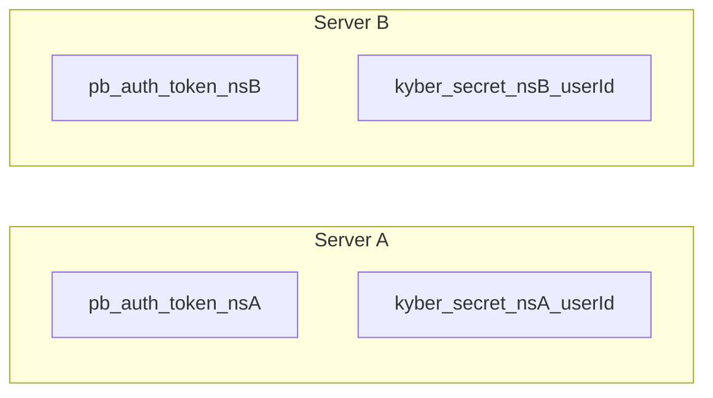

# State & Storage

Erebus uses two persistence layers: `flutter_secure_storage` for secrets and `shared_preferences` for non-sensitive app preferences.

## State Management

### Provider Setup

Registered in `lib/main.dart`:

```dart
MultiProvider(
  providers: [
    ChangeNotifierProvider(create: (_) => ThemeNotifier(initialTheme)),
    ChangeNotifierProvider(create: (_) => AuthProvider()),
  ],
  child: const MyApp(),
)
```

### AuthProvider

**File:** `lib/classes/auth_provider.dart`

Central application state for authentication and server management.

| Property / Method | Type | Description |
|-------------------|------|-------------|
| `pb` | `PocketBase` | Active PocketBase client instance |
| `isAuthenticated` | `bool` | `pb.authStore.isValid` |
| `isCheckingAuth` | `bool` | True during initial session restore or server switch |
| `currentUser` | `RecordModel?` | Authenticated user model |
| `servers` | `List<String>` | All server URLs |
| `serverEntries` | `List<ServerEntry>` | URLs with nicknames |
| `selectedServer` | `String` | Active server base URL |
| `e2eeKeyNamespace` | `String` | Namespace for E2EE storage keys |
| `login()` | Method | Authenticate and ensure E2EE keys |
| `register()` | Method | Create new user account |
| `logout()` | Method | Clear auth store |
| `setSelectedServer()` | Method | Switch server and rebuild client |
| `addServer()` | Method | Add server to list |
| `updateServer()` | Method | Edit server URL/nickname |
| `removeServer()` | Method | Remove server (min 1 required) |
| `ensureE2eeKeysReady()` | Method | Generate/upload E2EE keys |

**Lifecycle:**

1. Constructor calls `_initializePb()`
2. Load servers → load selected → rebuild PocketBase → restore auth
3. Set `isCheckingAuth = false` → `notifyListeners()`
4. `pb.authStore.onChange` listener calls `notifyListeners()` on any auth change

### ThemeNotifier

**File:** `lib/classes/themes.dart`

| Property / Method | Description |
|-------------------|-------------|
| `currentTheme` | Active `AppThemeData` |
| `setTheme(AppThemeData)` | Switch theme and persist name to SharedPreferences |
| `getThemeByName(String)` | Lookup theme by name |

## Secure Storage (`flutter_secure_storage`)

### CustomSecureAuthStore

**File:** `lib/classes/secure_auth_store.dart`

Implements PocketBase's `AuthStore` interface with persistent backing.

| Key Pattern | Content |
|-------------|---------|
| `pb_auth_token_{namespace}` | JWT auth token |
| `pb_auth_model_{namespace}` | JSON-encoded `RecordModel` |

**Namespace:** Derived from server URL via `ServerStore.namespaceForServer()`.

**onChange listener:**
- Valid auth → write token + model
- Invalid/cleared → delete both keys

**restore():**
1. Read token and model from storage
2. Call `save(token, model)` to populate in-memory store
3. Attempt `pb.collection('users').authRefresh()`
4. On failure → clear storage, return false

### E2eeSecureStorage

**File:** `lib/services/e2ee/secure_storage.dart`

| Key Pattern | Content |
|-------------|---------|
| `kyber_secret_{namespace}_{userId}` | Base64 ML-KEM-512 secret key |
| `dilithium_secret_{namespace}_{userId}` | Base64 Dilithium2 secret key |

Without namespace (legacy fallback):
- `kyber_secret_{userId}`
- `dilithium_secret_{userId}`

**Methods:**
- `writeBase64(key, value)` — Store base64 string
- `readBase64(key)` — Read base64 string (nullable)
- `delete(key)` — Remove entry

## Shared Preferences

### ServerStore

**File:** `lib/classes/server_store.dart`

| Key | Type | Content |
|-----|------|---------|
| `pb_servers_list` | `StringList` | JSON-encoded `ServerEntry` objects |
| `pb_selected_server` | `String` | Currently selected server URL |

**ServerEntry structure:**
```json
{
  "url": "http://example.com:8090",
  "nickname": "example.com"
}
```

**Migration:** Legacy plain URL strings in `pb_servers_list` are automatically converted to JSON entries on load.

**URL normalization:**
- Trim whitespace
- Prepend `http://` if no scheme detected

**Namespace derivation:**
```dart
base64Url.encode(utf8.encode(url)).replaceAll('=', '')
```

### Theme Persistence

| Key | Type | Default |
|-----|------|---------|
| `selectedThemeName` | `String` | `Royal Cipher Dark` |

Set in both `main.dart` and `ThemeNotifier.setTheme()`.

## Storage Isolation Per Server

Switching servers creates a completely isolated context:



This allows the same device to maintain separate accounts and key material for different PocketBase instances.

## In-Memory Caches (Non-Persistent)

| Cache | Class | Key Format |
|-------|-------|------------|
| Public keys | `PublicKeyRepository` | `userId` |
| Downloaded files | `PbFileDownloader` | `collection/recordId/filename` |
| Decrypted messages | `ChatScreen._decryptedMessages` | `messageId` |
| Message records | `ChatScreen._messages` | `messageId` |

## Data Flow on Server Switch

1. `setSelectedServer(url)` → `isCheckingAuth = true`
2. Save new selection to SharedPreferences
3. `_rebuildPocketBase()`:
   - Create new `CustomSecureAuthStore` with new namespace
   - Create new `PocketBase` client
   - Restore auth for that server's saved session
4. `isCheckingAuth = false` → UI rebuilds
5. If authenticated on new server → Home; else → Login

## Security Considerations

| Data | Storage | Risk Level |
|------|---------|------------|
| Auth tokens | Secure storage | High — protected |
| E2EE secret keys | Secure storage | Critical — protected |
| Server URLs | SharedPreferences | Low — public information |
| Theme name | SharedPreferences | None |
| Decrypted messages | RAM only | Cleared on screen dispose / app kill |
| Public keys | RAM cache | Public data |

## Related Documentation

- [Architecture](./architecture.md) — Auth flow diagrams
- [E2EE Cryptography](./e2ee-cryptography.md) — Key management
- [Getting Started](./getting-started.md) — First-run behavior
